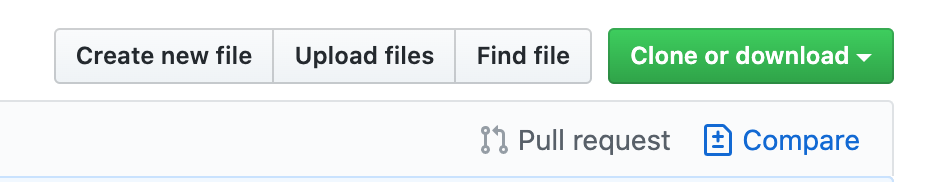
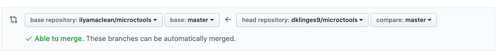
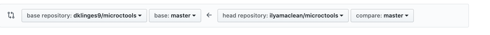
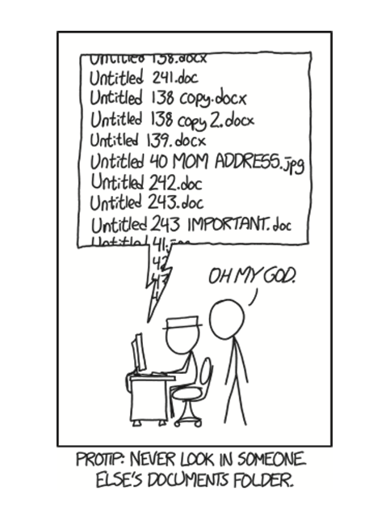
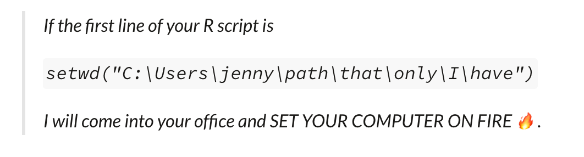

# Introduction to Git and GitHub


_Version control and file management without pulling your hair out_


## Learner Feedback from 2020-05-29

Following the [UF Data Carpentry class](https://datacarpentry.org/semester-biology/materials/version-control-R/) format would be really effective. Of note is **using RStudio plug in rather than GitHub Desktop**.  

There were a few folks that had done 1-2 intro Git workshops before, and yet haven't quite started using it. For a workshop with collaborators, a **precise set of follow-up actions items** would be effective.  


## Learner Feedback from 2021-02-10
(_Only provided the intro Google Slides, structuring reproducible projects, and R script tips parts_)  
(_already incorporated some thoughts from this_)  

Liz asked a good question: why not just have one R script for all of my code?  

Miguel: important to note that GitHub can have both public and private repositories, because you may want one or the other for particular projects/products  

Both for those who were new to the practice and to those who had heard of it before, folks were appreciative of mentioning the headers in RStudio!  

_note from self:_ important to note that with Git, ultimately it's all about habitat building. For simple projects, it doesn't feel necessary, but for complex project where you would appreciate it, it's hard to implement if you're not familiar. So build that right habits starting with the simple projects!  

---

The goals of this tutorial are to demonstrate the potential of using Git and GitHub for reproducible research. This does not entail reviewing the nitty-gritty of Git version control– there's many accessible resources for that– but provides the basic tools and language to effectively collaborate on other's projects, and get started with your own.  

Hopefully everyone comes away with either some new knowledge/skills, or additional inspiration for how to teach your colleagues about the practices you've been implementing.  

---

- how to structure a repository in an intuitive fashion that makes access easy for others (e.g. how many/what subdirectories to have, what their contents will be, directory naming conventions, etc.
- some suggestions on using READMEs to document directories and files (a little bit of overview on Markdown)
- some helpful tips when writing R code that will be part of a dynamic repository (mostly related to relative filepaths: why I discourage using setwd(), how to make file paths relative and include wildcard characters, etc.)
  

---

**For the instructor (me)**:  
Windows you will need open:  
- this markdown file  
- 2 tabs on GitHub  
- 1 tab with Google Slides  
- 3 Finder windows: Template repo, SoilTemp repo, Downloads   
- GitHub Desktop  

&nbsp;
&nbsp;

---

## Agenda
- Intros, housekeeping, troubleshooting, etc. (10 mins)  
- Why Reproducibility and Version Control (5 mins)  
- Why GitHub for reproducible research (5 mins)  
- GH repository structure (5 mins)  
- Git basics (15 mins)
	- Git workflow 
	- fork and clone 

- Reproducible Repository Structure (20 mins)  
	- repo structure  
	- documentation using markdown 
		- quick basics to Markdown  
		- what to put in a root README   
		- what to put in subdirectory READMEs    
- Git basics: (10 mins) 
	commit 
- BREAK (15 mins)  
---

- coding for reproducibility (15 mins)  
	- R projects
	- Script architecture  
- Git: git attributes and pushing (20 mins)  
	- .gitignore  
	- working with large files: Git LFS 
		- setting up Git LFS  
		- tracking files  
		- storing files locally  
	- pushing to remote    
- helping with SoilTemp (15 mins)   
- GH perks: academic discounts, etc. (10 mins)  

_Modules under development:_  
- Clean data structuring  

---

## Housekeeping

- Recording ok?  
- if you need to hop off for a few minutes, that's fine  
- Preferably stay unmuted and keep video on  
- I'll be sharing screen often  
- Vilna will be helping with the chat  
- I will make mistakes, and that's a good thing  

---


#### Notes to learners
- if you're following, give me thumbs up icon or head nod or say yes. If something wasn't clear, that's my fault– please let me know!  
- Ask questions! I'm perfectly fine with awkward silences if it leads to someone asking their question  
- I've given a version of this tutorial before but lots of mods, please feedback!  
- Provide input on what you and your collaborators do differently/better  

&nbsp;
&nbsp;
&nbsp;
&nbsp;

---

## Git and Reproducible Workflows: Intro (_10 mins_)
_why use version control? Developing software and managing data so that others can access your work easily and you'll remember what you've done_  

- setting up a GitHub repository in an effective manner
- how to make code portable for collaborators
- using Markdown to document code and files: the value of READMEs
- working with large files

---

### What is reproducibility and why?  


What: We should think of our projects as self-contained packages (much like an R package) that can be downloaded/imported by others and, for the most part, understood by them too. "Ideally a collaborator should be able to run the entire project without changing any code or files" ([source](https://ecoforecast.org/reproducible-forecasting-workflows/)). Working towards FAIR principles (Wilkinson et al. 2016)  

Who: for others, but oftentimes for ourselves. 

Why: 
- Well, for six months from now when you need to open up your code again from a paper back from review, and you haven't thought about the project since. 
- But also, it seems the field is (luckily) moving towards encouraging (and maybe soon mandating) that the whole project workflow is published. As in, we've long been accustomed to publishing our papers (interpretation of the findings) and our getting better at publishing our data (the findings themselves), the next step is publishing our code (how we connected the findings to the interpretation).  

---

### Why version control?

**HEAD TO GOOGLE SLIDES HERE**  

### Why GitHub?

- the benefit of Dropbox and GitHub over external drive is that files can be shared over Dropbox and GitHub but I can't send files directly from an external drive. So external drive good for processing data on my own, but not for collaboration  

---

- the benefit of GitHub over Dropbox is:  
1) that you can keep a history of your changes to the files (that's what version control is). Think of Microsoft Word's track changes, but for data and code. This is helpful for documenting progress, and if something is screwed up you can revert to a previous version of data/code without the need to remember what exact changes you made  

2) with GitHub, files talk to each other better than on Dropbox. On Dropbox you need to either manually drag 'n drop each file into your online Dropbox, which can take a lot of time, or have everything stored in a folder that is on Dropbox– RStudio doesn't like this latter option because Dropbox constantly tries to refresh the folder by grabbing files and looking at them, and RStudio gets angry because it wants to be using the files at the same time  
&nbsp;

---

3) GitHub is much better for display online than dropbox. Markdown is good to generate reports with figures and code....GitHub is set up so that Markdown files are displayed automatically. See Rebecca Senior's ThermStats and the Coastal Carbon database that I managed for the Smithsonian– the text and figures displayed when you scroll down on either of them are put together on a Markdown. I like this because one of my collaborators can access the GitHub webpage, get an immediate refresher of what this project is, and jump right into contributing. You can't display like this on Dropbox.  
&nbsp;
4) You'll be more prepared for navigating (and deploying) software packages.  Many R and Python packages have developer versions hosted on GH 


## Starting with Git and GitHub  
_a brief overview of how Git works_   

### The Git Workflow (_5 mins_)  

_On Google Slides_  

---

### Resources

[Carpentries Git tutorial](https://swcarpentry.github.io/git-novice/)  
https://happygitwithr.com/rstudio-git-github.html


Like Drive or Dropbox...but with a specific system for uploading/downloading files.  


Benefits of distinct local and remote:  
- can keep messy files remote  
- allows for experimentation (branches, forks, etc.)  

- **Assuming at this point that everyone is logged into their account** 

&nbsp;
&nbsp;

---

#### Navigating GitHub Repository Website (_5 mins_)  

**While they are looking at repos**:  
- think of a GH repo as a Google Drive or Dropbox folder...but with more structure geared specifically towards code  
- you'll notice many of these repos have similar structures: not coincidence  
- Some are databases, some are projects/manuscripts, some are R packages. GH good for all of these  

[Reproducible Research Template](https://github.com/dklinges9/Reproducible-Research-Template)  


**Databases**:  
[Coastal Carbon Network Data Library](https://github.com/Smithsonian/CCRCN-Data-Library) (also see [RShiny app](https://ccrcn.shinyapps.io/CoastalCarbonAtlas/))  

[ForestGEO ForC](https://github.com/forc-db/ForC) (also see [website](https://forc-db.github.io/) and [RShiny app](https://forc.shinyapps.io/global_data_visualization/))    

&nbsp;

**Projects**:  
[PortalData](https://github.com/weecology/PortalData)  
[Animal Social Networks](https://github.com/bansallab/asnr/) (also see [website](https://bansallab.github.io/asnr/data.html))   
[Hanson et al 2020 Global Priority Areas](https://github.com/jeffreyhanson/global-protected-areas)  

&nbsp;

**R Packages**:  
[RGedi](https://github.com/carlos-alberto-silva/rGEDI)  
[Mike Kearney's NicheMapR](https://github.com/mrke/NicheMapR) (also see [website](https://mrke.github.io/))  
[prioritizr: conservation prioritization](https://github.com/prioritizr/prioritizr)   
[ThermStats](https://github.com/rasenior/ThermStats)  

&nbsp;

_a number of languages (unfortunately not R) are supported for code view on GH. [See here for more](https://help.github.com/en/github/managing-files-in-a-repository/navigating-code-on-github)._  


&nbsp;
&nbsp;


#### 5 Commands to Remember:

- `git pull` 
- `git status`   
- `git add`  
- `git commit`
- `git push`  

Everything else: [cheatsheets](https://github.github.com/training-kit/downloads/github-git-cheat-sheet.pdf) and [StackOverflow](https://stackoverflow.com/questions/315911/git-for-beginners-the-definitive-practical-guide)   

&nbsp;


### Getting Started: Forking and Cloning (_10 mins_)  
&nbsp;

#### Fork a Repository
Fork: create a copy of a remote repository that is stored on the remote server


- Top right of webpage: "Fork". This will take a few seconds...  

### Updating a forked repository

If you want to update a forked repository to its “base"...once you have forked a repo, and the original base has new changes:  

- go to the page for your forked version of the repo. click on either the “pull request” or “compare” button:  

  

- you’ll see a flow chart with the original version on the left, an arrow pointing left, and then your forked version on the right:  
  

- you want to switch that order: do so by clicking on the box for DigitEnv/name-of-repository, and swapping it for the original base repository. The page will reload. Then press “compare across forks” right above. Then switch the other (left) box around. You should now have the opposite of the original order:

  

After this, the merge acts like a commit: write a merge title (e.g. “updating forked version of repo XXX”) then press the green buttons to submit the pull request, and then approve the pull request. Your forked version should now be updated to the original!
Hopefully that was coherent….this can be done [a little more swiftly via Git in Bash.](https://help.github.com/en/github/collaborating-with-issues-and-pull-requests/syncing-a-fork)  

#### Clone the Repository

There's a variety of ways you can interact with Git. For demonstrative purposes, I'll start with the GitHub Desktop GUI (graphical user interface), but you can also use Bash scripting via Command Prompt/Terminal, [Git via RStudio](https://support.rstudio.com/hc/en-us/articles/200532077?version=1.0.153&mode=desktop), or the Git GUI.  


**Desktop GUI**:  
- Click "Clone or Download" and the Clipboard icon  
- Go to GitHub Desktop app, File>Clone Repository  
- Paste url and designate local location  
- It may ask you to initialize Git LFS. If you click yes it will prompt you to download  

**Bash**:
- `git clone insert-github-repo-link-here.git`


**STOP FOR QUESTIONS HERE**  

##### How Many Repositories?
- 1 repository =/= 1 paper  
- organized by collaborators, applications, and content  
- think about access: private vs public, and timelines (nice to make repos public eventually) 
- example: [CCRCN Data Library](https://github.com/Smithsonian/CCRCN-Data-Library) and [CCRCN Atlas](https://github.com/Smithsonian/CCRCN-Data-Library-Map)  

&nbsp;
&nbsp;
&nbsp;
&nbsp;

---

## Structuring Repositories for Reproducible Workflows (_15 mins_)  
_Good practices of where to put files and why_
  
_sources:_  
- [EFI Task Views: Reproducible Forecasting Workflows](https://ecoforecast.org/reproducible-forecasting-workflows/)    
- [Python Guide Structure](https://docs.python-guide.org/writing/structure/)  
- [Project Workflows](https://www.r-bloggers.com/%F0%9F%93%81-project-oriented-workflow/)  
- [What They Forgot to Teach You About R: a textbook](https://rstats.wtf/)  


### Items
- What is reproducibility and why?  
- Organizing files for reproducibility  
- Organizing R code for reproducibility  

---

When a potential user or contributor lands on your repository’s page, they see a few things:

- Project Name  
- Project Description  
- Bunch O’ Files  

Only when they scroll below the fold will the user see your project’s README.

If your repo is a massive dump of files or a nested mess of directories, they might look elsewhere before even reading your beautiful documentation.

Dress for the job you want, not the job you have.  


   

&nbsp;

General principle: **someone with sparse knowledge of the project should be able to open it up and after some brief acquaintance be able to run everything themselves.**  
_Thinking of projects as packages_  

&nbsp;
&nbsp;

---

### Working directories

To keep our projects self-contained, we want a folder that holds all the necessary stuff, but not the unnecessary stuff  

Oftentimes our code relies on files stored on our computer (e.g. data) and we need the computer to know where to look  

Designating a working directory achieves these things.  

---

#### Proposed Project Template 

my_project  
|  
-- README.md  
-- ./data 
-- ./docs  
-- ./scripts  
-------/00_source  
-------/01_data_extraction  
-------/02_data_curation  
-------/03_data_compilation  
-------/...  
-------/07_analysis  
-- ./figures  
-- ./reports  
-- ./analysis-outputs  

---


Now, what if I usually have all of my code in one script. What's the point of having all of these multiple scripts for our code, why not just one?  

It's a matter of preference! But here's a pitch for having multiple scripts:  
- I'm your collaborator, you sent your project to me and asked for feedback on the modeling. Do I want to open up "research_code.R" and dig through the 690 lines of code to find the right section, or do I want to open up the script call "build_glm.r"?  
- I use the same dataset for multiple projects, and for each project I need to perform the same data curation/cleaning. Pretty easy to just copy + paste my "data_cleaning.R" script into another project, less easy to dig through my one script to find the right section  
- Carly: I use git for file version control. I made some changes to my analysis and generating my figures, but I want to keep those changes (commits) separate in my change log history. It's easier to do this if analysis and figure generation are in different scripts, harder if they're in the same script.  
- From a matter of principle, a script should have a set of inputs and a set of outputs. Oftentimes our projects have multiple intermediate products, such as a cleaned, analysis-ready datafile. We want a .csv of that file for future use. But it's not ideal to bury that write_csv() command in the middle of a script. Rather, we should end our script after write_csv(), and have new script(s) for steps after that.  

**Licences**  

not always necessary for research, but good to read up on them. Here's some good resources:  

[Zenodo license fact sheet](https://zenodo.org/record/840652/files/Open%20Science.pdf?download=1)  
[Figshare license history](https://help.figshare.com/article/copyright-and-license-policy)  
[Dryad license explanation](https://blog.datadryad.org/2011/10/05/why-does-dryad-use-cc0/)  

**Alternatives:**  


/src

data/src  
data/raw  


(_drop links to repos again if desired_)  

Not the only structure, but generally I use this.  

_Pros_:  
- easier to drag and drop data directories into new projects  
- organized by file type: there will never be a .csv in the scripts folder. I think this is easy to find files  
- easier to .gitignore or git-lfs large files if they are all stored in the same directory  
- simple, makes it easier for someone to find readme  

_Cons_:  
- data is often intrinsically linked to code. Naturally, certain data and code files should be sorted together.  
- could be more modular  
- for especially large projects, impossible to attempt to sort through a single directory that stores ALL of the code or ALL of the data without linking to each other  

**Main takeaway**: there is no single template to fit all projects or needs. What we should strive to do is structure our projects in a way that is intuitive to a large audience but also familiar to a more specialized audience.  


&nbsp;
&nbsp;


## Documentation and READMEs with Markdown

READMEs will be the first thing that most developers/researchers will look at (hopefully). Make them simple and to the point.  

### Contents of a root README
- contact info
- short abstract
- some navigational help
- dependencies

&nbsp;  

#### Markdown Formatting

`# create a header`
# Create a header

&nbsp;

`### smaller header`
### smaller header  

&nbsp;

`**bold text**`  
**bold text**  

&nbsp;

`add two spaces" "" " `  
`to create a line break`  
add two spaces  
to create a line break

&nbsp;

`[text for your link](https://soiltemp.weebly.com/)`  
[text for your link](https://soiltemp.weebly.com/)  

&nbsp;

From Chrome users, see [Markdown Preview Plus](https://chrome.google.com/webstore/detail/markdown-preview-plus/febilkbfcbhebfnokafefeacimjdckgl). After install, enable "Allow access to file URLs" in Extensions (menu > More tools > Extensions or enter URL chrome://extensions/ instead). Then drag-n-drop a Markdown file onto Chrome and use your favorite editor to edit.  


**Markdown guides**  :
[Markdown Cheatsheet](https://rstudio.com/wp-content/uploads/2015/03/rmarkdown-reference.pdf) for adding some formatted text  
[Syntax Guide](https://guides.github.com/features/mastering-markdown/)  
[Intro to RMarkdown](https://rmarkdown.rstudio.com/articles_intro.html)  

&nbsp; 

### **Exercise: everyone add a README**  

- Find your designated file, or generate a Markdown readme  
- Navigate to your desired directory, open Terminal/Command Prompt  
- "touch README.md"  
- If we can't get to work, a README.txt is also fine  
- can also add a directory: but note an empty folder doesn't exist to Git  

&nbsp;


##### Learn More
**[NEON Version Control with GitHub](https://www.neonscience.org/version-control-git-series)**  


&nbsp;
&nbsp;
&nbsp;
&nbsp;
&nbsp;
&nbsp; 

## Break (_15 mins_)  

While we're gone, could install [Git LFS](https://git-lfs.github.com/)  
- (_see [these instrutions](https://help.github.com/en/github/managing-large-files/installing-git-large-file-storage)_) 

&nbsp;
&nbsp;
&nbsp;
&nbsp;

--- 

## Reproducible R scripts

---

#### R Scripts as part of a Project Ecosystem
_Thinking of projects as packages_   

- scripts should be organized with awareness of your project space: self-contained projects as folders  
- every script assumes that:
	- the working directory will be set to this folder  
	- there will be nothing already loaded in the R environment  
	- it will install/load only what is needed (for data and packages)  


_Break your scripts up into manageable chunks, which are not necessarily in the order in which you wrote them._  

Not just good for GitHub....not just good for collaborators....more portable for future self.  

---

&nbsp;

#### Workflow versus Product  
**Workflow**: personal habitats and accessories  
- The editor you use to write your R code.  
- The name of your home directory.  
- The R code you ran before lunch.  

**Product**: the raw data and the code needed to get your results  
- The raw data.
- The R code someone needs to run on your raw data to get your results, including the explicit library() calls to load necessary packages.  

_sources:_  
[Jenny Brown](https://www.tidyverse.org/blog/2017/12/workflow-vs-script/) 

---

&nbsp;
&nbsp;
&nbsp;
&nbsp;

### Transitioning to RStudio
_A few tips 'n tricks to make coding in a portable repository easier_  

**Head over to RStudio**  
**Create a New RStudio Project**  
**Navigate to the curation script template**  

---

#### Why there is a 10th circle of hell for those that use `setwd()`

The chance of the setwd() command having the desired effect – making the file paths work – for anyone besides its author is exactly 0%.  

  

_NE MODIFIER PAS LE REPOTOIRE DE TRAVAIL AVEC `SETWD()`. JAMAIS._  

&nbsp;
&nbsp;


#### Flexible reference to directories

Workspaces are inherently dynamic: files and folders are always changing. We should code that is flexible for these changes.  

_Recall that we named our directories "01_XXX", "02_YYY", "03_ZZZ, etc..._  
But what if you realize you forgot a step, and now have to add another folder as step 02. Then all my other folders change names, and this breaks my file path references in my R code. Well, **not quite** if we plan ahead!  


We can refer to scripts with wildcards if we use `Sys.glob()`:  
source(Sys.glob("scripts/*_data_selection/hello_world.R"))  

Same goes with reading in data. We can have multiple wildcards too:  
read.csv(Sys.glob("data/enviro_*eters/data_sources/VanDenHoogen_*.csv"))  

---

#### Modularity: producing functions

If you are ever to this action again (and you will), write it as a function. Spend the extra 20% time now to save 100% (ok, 90%) of your time later.  

&nbsp;
&nbsp;
&nbsp;

---

#### Some RStudio formatting options

##### [use headers to fold code sections](https://support.rstudio.com/hc/en-us/articles/200484568-Code-Folding-and-Sections) 
- *Collapse* — Alt+L  
- *Expand* — Shift+Alt+L  
- *Collapse All — Alt+O  
- *Expand All* — Shift+Alt+O  
- *Insert Section* — Ctrl+Shift+R (Cmd+Shift+R on the Mac)  
- *Jump To Section* — Shift+Alt+J  

---


### Saving objects to files, not workspaces

For instance:  

```
library(raster)

# Load big raster into R
big_raster <- raster("data/mybignastyrasty.tif")

# Do operation on raster that takes forever....
raster_2 <- big_raster_operation(big_raster, fun = massive)

# wait...
# wait...
# wait...

# FINALLY. That took so long!! I want to save workspace so I don't have to do again!!

```

---

```
library(raster)

# Load big raster into R
big_raster <- raster("data/input/mybignastyrasty.tif")

# Do operation on raster that takes forever....
raster_2 <- big_raster_operation(big_raster, fun = massive)

# wait...
# wait...
# wait...

# FINALLY. That took so long!! To avoid doing it again, let's save intermediate product as RDS file
saveRDS(raster_2, "data/intermediate/raster_2.rds") # longer runtime, but smaller object
write_rds(raster_2, "data/intermediate/raster_2.rds") # shorter runtime, larger object

```

---

### Using Packrat for package management 

_Need to develop this content._  


#### Related Resources

Workflow and Dependency Management:  
- [Drake](https://github.com/ropensci/drake) is built for R  
- [here's a more extensive list](https://github.com/common-workflow-language/common-workflow-language/wiki/Existing-Workflow-systems) as well  

Continuous Integration and Automation:  
- this [EFI Tasks Views blog post](https://ecoforecast.org/reproducible-forecasting-workflows/) has some good info on this  

## Back to Using Git  

#### .gitignore

https://github.com/github/gitignore


**Remove DS_Store files**:  
_**why wouldn't we want to commit our .Rproj file?**_  


### Other potential content:

- **Licenses**:
[Software Carpentries recommendations](https://swcarpentry.github.io/managing-research-software-projects/09-license/)  
[choosealicense](https://choosealicense.com/)  
GitHub has templates to choose from. See this [SO post](https://stackoverflow.com/questions/31639059/how-to-add-license-to-an-existing-github-project) for instructions.   


#### Commit to the local Repository

**Via the website**:  
Navigate to desired directory, drag 'n drop file(s)  

**Via the Desktop GUI**:  
- check the box for files you want to commit  
- type a summary  
- "Commit to master"  


**When should one commit really be two?**  There's no set in stone principles, the rule I follow: if you made more changes than you can describe in the 50-character summary limit, split it up.  


#### Push to the Remote Repository

**Via the Desktop GUI**:  
- just press push, **but** requires you to pull first (which you should always do)  


#### Same steps but in Command Prompt/Terminal

`git status`  
`git add`  
`git commit`  
`git pull`  
`git push`  


## Git Large File Storage

https://git-lfs.github.com/

_Resources_:  
- [Bitbucket LFS tutorial](https://www.atlassian.com/git/tutorials/git-lfs)  
- [4 min overview: what is Git LFS](https://www.youtube.com/watch?time_continue=260&v=9gaTargV5BY&feature=emb_title)  
**One of the drawbacks of Git and GitHub:** not good at handling large files. GH has a hard cap of 1 GB for an individual file.  

Luckily, there's a fix: Git LFS  


`git lfs install`  

`git lfs track your-file-path-here`  
OR  
`git lfs track "*.tiff"`  

_**MAKE SURE YOUR .GITATTRIBUTES FILE IS STAGED:**_  
`git add .gitattributes`

&nbsp;
&nbsp;


### Pulling LFS files that someone else committed

When you `git pull` after someone has pushed LFS objects, you'll get a file path for the LFS files....but it may not correspond to the file itself. Instead, it may be a file (with the same extension as the original file) that just has a few lines of text saying it's tracked by LFS.  

If this is the case, you'll need to `git lfs pull` to download the original files from LFS. A problem here: this modifies your local files, and therefore Git thinks you've made changes that need to be committed. One "fix" that I got to work (once so far) was staging, committing, then pushing the "modified" files, but then halfway thru the writing of the files, terminate the console run (just close the terminal window). After doing so, when I reopened the git history of the repo, apparently that files weren't "modified", and nothing had been pushed to remote. So....works?  

**Not a huge fan of the LFS ecosystem, need to look into/discuss better approaches.**  


### Alternatives to Git for file version control


Learning Git is hard. It's not for everyone, which is understandable. If we are solely reliant upon Git for file version control, and GitHub for storing/sharing our projects, we may exclude valuable collaborators who otherwise could contribute substantially.  

**Sometimes we can be flexible in the platforms we use, or how we code, to accommodate out collaborators.**  


`googlesheets4` package:  

What if you have a collaborative data file, but don't need to collaborate on the code? This is a helpful package.  

I used this recently for when a collaborator wasn't as comfortable with Git, and wanted to add data to a Google Sheet. No problem! I can automatically download the most recent version of the data on Sheets (much like `git pull`)  

**Demonstrate sample R script from vert strat meta**  


## Challenge

Contributing to SoilTemp: _because the real reason I organized this was to put you all to work!_  

List of data sources:  [see this google spreadsheet](https://docs.google.com/spreadsheets/d/1fVbkRYXmU21g4FV_g9t5_JNL4CzN1SqvT3Esmqq88es/edit?usp=sharing)  


Need to develop hook scripts for geographical/biological/pedological layers, 

- automated (ideally) or manual download of layers   
- clipping of layer to a particular scene/area  
- reproduction to standardized projection and coordinate system  
- interpolation/resampling to 1km and hourly/daily  
- curation: renaming, cleaning, etc.  

Also need to identify additional pedological layers that I'm not as familiar with– someone spend time on SoilGrids  


**My vision**: this will not just help SoilTemp daily offsets. A collection of scripts that each pull down and curate global geospatial layers for microclimate...can be really powerful. High-impact R package or suite of packages building on what exists.  

Data standards:  


## Signing up for Academic Discounts

[Instructions on how-to](https://help.github.com/en/github/teaching-and-learning-with-github-education/applying-for-a-student-developer-pack) 
[Apply here](https://education.github.com/)  

&nbsp;
&nbsp;

### Watching Repositories  

### Circling back: when to use Git and GitHub

- collaborations (come check out the SoilTemp daily offsets project).... 
- personal projects: do you ever use more than one machine?  
- iterative updates and [automatic commit-n-push](https://sarfraznawaz.wordpress.com/2013/12/06/automatic-git-commit-and-push/): especially good for near-term forecasting  


## Literature Organization
- even for citations, machine-readable is better (e.g. .bibtex)  


## Clean Data Structuring

### Tall vs Wide data


`pivot_longer` and `pivot_wider`  


### Naming and Populating Columns

_What's the purpose of your column? Is it unified by a single unit?_  

_Is the column's contents supposed to be a number, a category, or a description? Careful not to mix these..._  


**Mixing column contents**: say you have a column that is denoting a category for an observation, such as "male", "female", or "juvenile". You may want to include more information than just the category, but you will be doing yourself a favor if you included that additional info in a new column. For instance, say you're pretty sure this individual was a male, and wanted to jot down your notes why. But these notes in a sex_notes column instead of the same column. This way, you can filter your data to just males (sex == "males") and capture all of the rows you want (but otherwise, you wouldn't capture the row "male (and I know this because of its colors")  


