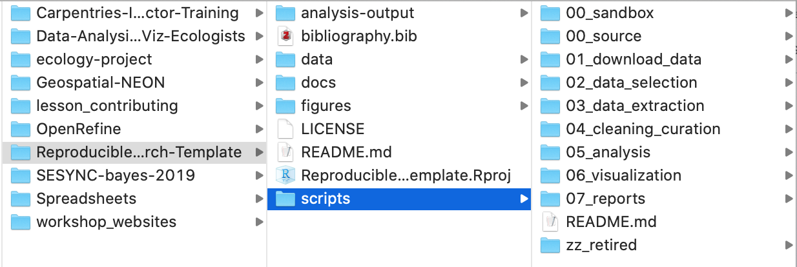

# Module: Designing Reproducible Research Projects (_for R Coders_)  

---

### Agenda
- What is reproducibility, what is version control, and why?  
- Organizing files for reproducibility  
- Organizing R code for reproducibility  

&nbsp;
&nbsp;
&nbsp;
&nbsp;

### _Resources used to develop this tutorial:_  

[EFI Task Views: Reproducible Forecasting Workflows](https://ecoforecast.org/reproducible-forecasting-workflows/)  

[Data Carpentries: Data Analysis in R for Ecologists](https://datacarpentry.org/R-ecology-lesson/index.html)  

[What They Forgot to Teach You About R: a textbook](https://rstats.wtf/)  

---

## What is reproducibility and why?  

What: projects as self-contained packages (much like an R package). Working towards FAIR principles (Wilkinson et al. 2016)  

Who: for others, but oftentimes for future self. 

Why:   
- 6 months from now when paper comes back from review and you don't remember how your code works.  
- publishing paper + data + code  

---

# Organizing files for reproducibility  

---

&nbsp;

&nbsp;

&nbsp;

---

When a potential user or contributor lands on your repository’s page, they see a few things:

- Project Name  
- Project Description  
- Bunch O’ Files  

---

&nbsp;

General principle: **someone with sparse knowledge of the project should be able to open it up and after some brief acquaintance be able to run everything themselves.**  
_Thinking of projects as packages_  

&nbsp;
&nbsp;

---

### Working directories

To keep our projects self-contained, we want a folder that holds all the necessary stuff, but not the unnecessary stuff  

Oftentimes our code relies on files stored on our computer (e.g. data) and we need the computer to know where to look  

Designating a working directory achieves these things.  

---

#### Proposed Project Template 

my_project  
|  
-- README.md  
-- ./data  
-------/input  
-------/intermediate  
-------/output  
-- ./docs  
-- ./figures  
-- ./reports  
-- ./scripts  
-------/00_source  
-------/01_data_extraction  
-------/02_data_curation  
-------/03_data_compilation  
-------/...  
-------/07_analysis  
-- ./analysis-outputs  

---

**Alternatives**

my_project  
-- ./src  

my_project  

-- ./data  
-------/src  
-------/raw   

---

&nbsp;
&nbsp;
&nbsp;
&nbsp;

_What project structures do you like?_  

---

**Licences**  

not always necessary for research, but good to read up on them. Here's some good resources:  

[Zenodo license fact sheet](https://zenodo.org/record/840652/files/Open%20Science.pdf?download=1)  
[Figshare license history](https://help.figshare.com/article/copyright-and-license-policy)  
[Dryad license explanation](https://blog.datadryad.org/2011/10/05/why-does-dryad-use-cc0/)  

---

# Reproducible R scripts

---

#### R Scripts as part of a Project Ecosystem
_Thinking of projects as packages_   

- scripts should be organized with awareness of your project space: self-contained projects as folders  
- every script assumes that:
	- the working directory will be set to this folder  
	- there will be nothing already loaded in the R environment  
	- it will install/load only what is needed (for data and packages)  

---

&nbsp;

#### Workflow versus Product  
**Workflow**: personal habitats and accessories  
- The editor you use to write your R code.  
- The name of your home directory.  
- The R code you ran before lunch.  

**Product**: the raw data and the code needed to get your results  
- The raw data.
- The R code someone needs to run on your raw data to get your results, including the explicit library() calls to load necessary packages.  

&nbsp;
&nbsp;
&nbsp;
&nbsp;
&nbsp;
&nbsp;
&nbsp;

_sources:_  
[Jenny Brown](https://www.tidyverse.org/blog/2017/12/workflow-vs-script/) 

---

&nbsp;

### Transitioning to RStudio
_A few tips 'n tricks to make coding in a portable repository easier_  

**Head over to RStudio**  
**Create a New RStudio Project**  
**Navigate to the curation script template**  

---

&nbsp;

### Alternatives to Git for FVC

Learning Git is hard. It's not for everyone, which is understandable. If we are solely reliant upon Git for file version control, and GitHub for storing/sharing our projects, we may exclude valuable collaborators who otherwise could contribute substantially.  

**Sometimes we can be flexible in the platforms we use, or how we code, to accommodate out collaborators.**  

---

`googlesheets4` package:  

What if you have a collaborative data file, but don't need to collaborate on the code? This is a helpful package.  

I used this recently for when a collaborator wasn't as comfortable with Git, and wanted to add data to a Google Sheet. No problem! I can automatically download the most recent version of the data on Sheets (much like `git pull`)  

**Demonstrate sample R script from vert strat meta**  

